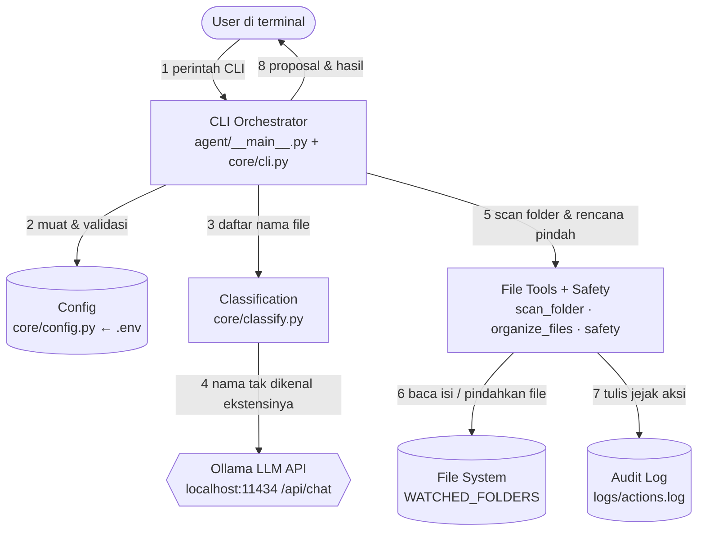
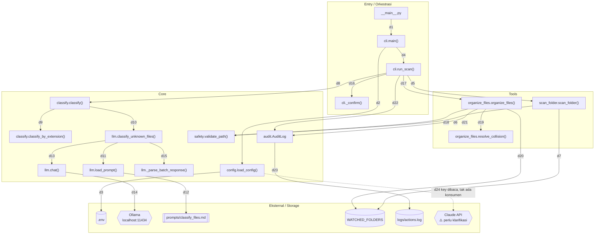

# ARCHITECTURE.md — FileMind

Diagram arsitektur **berdasarkan kode yang benar-benar ada di repo** (Phase 1:
CLI scan → classify → dry-run → execute). Komponen yang direncanakan tapi belum
diimplementasi **tidak** digambar sebagai bagian arsitektur; hal yang alurnya
menggantung di kode ditandai `⚠️ perlu klarifikasi`.

- **Tanggal:** 2026-08-29
- **Sumber:** `docs/archive/AUDIT_REPORT.md` + pembacaan langsung `agent/` dan `tests/`
- **Antarmuka saat ini:** CLI (`python -m agent scan ...`). Belum ada GUI/desktop shell.

---

## Diagram 1 — Overview Level Tinggi

**Penjelasan tiap koneksi:**

1. **User → CLI** — User menjalankan `python -m agent scan` (opsional `--folder`, `--execute`, `--no-llm`); `__main__.py` meneruskannya ke `cli.main()`.
2. **CLI → Config** — Saat start, `cli.main()` memanggil `load_config()` yang membaca & memvalidasi `.env`; kalau `WATCHED_FOLDERS` kosong/salah, proses berhenti dengan error (tidak pakai default demi keamanan).
3. **CLI → Classification** — `run_scan()` mengirim daftar nama file hasil scan ke `classify()` untuk ditentukan kategorinya; balikannya adalah kategori + tier ("rule"/"local") per file.
4. **Classification → Ollama** — Hanya nama file yang ekstensinya **tidak** dikenali peta rule yang dikirim ke model lokal (POST `/api/chat`); Ollama membalas JSON kategori yang lalu divalidasi. Kalau Ollama mati, langkah ini dilewati dan file jatuh ke `Other`.
5. **CLI → File Tools** — `run_scan()` memanggil `scan_folder()` untuk mendata file, lalu `organize_files()` dengan daftar rencana pindah (`Move`); tiap tool memvalidasi path lewat `safety` sebelum bertindak.
6. **File Tools → File System** — `scan_folder` hanya **membaca** isi folder (read-only); `organize_files` **memindahkan** file ke subfolder kategori (`shutil.move`) hanya bila `dry_run=False`.
7. **File Tools → Audit Log** — Sebelum tiap pemindahan, `organize_files` menulis record `planned`, lalu `ok`/`failed` sesudahnya, ke `logs/actions.log` (satu objek JSON per baris).
8. **CLI → User** — CLI mencetak proposal (dry-run) atau ringkasan hasil eksekusi kembali ke terminal.

---

## Diagram 2 — Detail Interaksi Komponen Inti

**Penjelasan tiap koneksi:**

- **d1 `__main__.py` → `cli.main()`** — Entry point `python -m agent` memanggil `main()` dan mengembalikan exit code-nya ke shell.
- **d2 `cli.main()` → `config.load_config()`** — Sebelum apa pun, konfigurasi dimuat; kalau gagal, `main()` mengembalikan exit code 2 tanpa lanjut.
- **d3 `load_config()` → `.env`** — `python-dotenv` membaca `.env` di root repo, lalu tiap nilai (WATCHED_FOLDERS, OLLAMA_MODEL, threshold, dll.) divalidasi.
- **d4 `cli.main()` → `cli.run_scan()`** — Subcommand `scan` didispatch ke `run_scan()`, dengan folder default = entri pertama `WATCHED_FOLDERS` bila `--folder` tak diberikan.
- **d5 `run_scan()` → `scan_folder()`** — Meminta daftar file lepas di folder target beserta hitungan yang dilewati (direktori, folder agen, download berjalan, file tersembunyi).
- **d6 `scan_folder()` → `validate_path()`** — Folder yang mau dipindai dicek dulu: harus di dalam whitelist dan bukan path sistem yang di-hard-block; kalau tidak, scan ditolak.
- **d7 `scan_folder()` → File System** — Membaca isi folder top-level (`iterdir` + `stat`) secara read-only; tidak pernah mengubah apa pun.
- **d8 `run_scan()` → `classify.classify()`** — Mengirim daftar nama file untuk diklasifikasikan ke kategori tujuan.
- **d9 `classify()` → `classify_by_extension()`** — Peta ekstensi (deterministik) menyelesaikan mayoritas file tanpa melibatkan model sama sekali.
- **d10 `classify()` → `llm.classify_unknown_files()`** — Hanya sisa nama tanpa rule yang cocok yang dieskalasi ke model — dan hanya bila `use_llm=True` serta `config` tersedia.
- **d11 `classify_unknown_files()` → `load_prompt()`** — Memuat prompt sistem klasifikasi sebelum menyusun request.
- **d12 `load_prompt()` → `prompts/classify_files.md`** — Membaca file prompt berversi dari disk (`classify_files.md`).
- **d13 `classify_unknown_files()` → `llm.chat()`** — Mengirim nama file dalam batch (maks 25) + prompt, dengan `format=json`.
- **d14 `chat()` → Ollama** — POST `/api/chat` ke `localhost:11434` via `requests`, `num_ctx` diset eksplisit; kalau tak terjangkau, mengembalikan `None` (bukan exception) dan run lanjut rules-only.
- **d15 `classify_unknown_files()` → `_parse_batch_response()`** — Balikan model diparse & divalidasi: JSON rusak, nama file yang tak ada di batch (halusinasi), atau kategori di luar daftar → dibuang, lalu jatuh ke `Other`.
- **d16 `run_scan()` → `_confirm()`** — Untuk mode `--execute`, kalau jumlah file melebihi `BATCH_CONFIRM_THRESHOLD`, user harus mengetik `yes` (safety rule 6); di bawah threshold langsung lolos.
- **d17 `run_scan()` → `organize_files()`** — Mengirim daftar `Move`; `dry_run=True` untuk preview, `dry_run=False` hanya setelah `--execute` + konfirmasi.
- **d18 `organize_files()` → `validate_path()`** — Tiap file dicek dua kali: path sumber dan folder tujuan (`must_exist=False`) — tidak memercayai argumen apa pun, termasuk dari rule engine sendiri.
- **d19 `organize_files()` → `resolve_collision()`** — Kalau nama tujuan sudah ada (di disk atau sudah diklaim di batch ini), dibuat `name (1).ext` — tidak pernah menimpa.
- **d20 `organize_files()` → File System** — `shutil.move` memindahkan file ke subfolder kategori di dalam folder yang sama; error per-file (mis. file terkunci) dicatat dan tidak menghentikan batch.
- **d21 `organize_files()` → `AuditLog`** — Menulis `planned` sebelum tiap move, lalu `ok`/`failed` sesudahnya (dry-run tidak menulis apa pun).
- **d22 `run_scan()` → `AuditLog`** — `run_scan` membuat instance `AuditLog` dan mencatat `skipped` saat user membatalkan di prompt konfirmasi.
- **d23 `AuditLog` → `logs/actions.log`** — Setiap record ditulis sebagai satu baris JSON (append-only); kegagalan menulis log dilaporkan ke stderr tapi tidak menjatuhkan run.
- **d24 `load_config()` ⇢ Claude API `⚠️`** — `load_config()` membaca `ANTHROPIC_API_KEY` ke `Config`, **tetapi tidak ada kode yang memakainya** — tidak ada klien Anthropic, tidak ada pemanggilan. Alur berhenti di sini. `⚠️ perlu klarifikasi`: apakah ini memang cadangan tier cloud Phase 3, atau perlu dirapikan.

---

## Titik Integrasi Eksternal

| Integrasi | Status di kode | Lokasi |
|---|---|---|
| **Ollama** (LLM lokal, `localhost:11434/api/chat`) | **Aktif** — satu-satunya integrasi eksternal yang benar-benar dipanggil. Opsional: run tetap jalan (rules-only) bila mati. | `core/llm.py:61` |
| **Claude API** (`ANTHROPIC_API_KEY`) | **Tidak aktif** — key dimuat ke config tapi tak ada konsumen. Ditandai `⚠️` di Diagram 2. | `core/config.py:104` |
| **File System** (baca/tulis) | Aktif — read via `scan_folder`, write via `organize_files`, dibatasi `WATCHED_FOLDERS`. | `tools/*.py` |
| **`.env`** (sumber konfigurasi) | Aktif — dibaca `python-dotenv` saat start. | `core/config.py` |
| **`prompts/classify_files.md`** | Aktif — dibaca `llm.load_prompt()`. | `core/llm.py:133` |
| **`logs/actions.log`** (storage jejak) | Aktif — output audit JSONL. | `core/audit.py` |
| **Vector DB** | **Tidak ada** — tidak ditemukan di kode. | — |
| **Database / storage lain** | **Tidak ada** — tidak ada DB; state hanya file system + log + `.env` + prompt. | — |

---

## Yang Belum Terhubung (sengaja tidak digambar sebagai arsitektur)

Berikut ada di repo tapi **belum** menjadi bagian alur yang berjalan, jadi tidak
dimasukkan sebagai komponen aktif di diagram (sesuai aturan: hanya kode nyata):

- **`agent/routing/`** — paket kosong; logika keputusan lokal-vs-cloud direncanakan Phase 3, belum ada kode.
- **`prompts/system_prompt.md`** — persona/aturan tool untuk chat loop Phase 2; belum dibaca kode mana pun (hanya `classify_files.md` yang dipakai).
- **Chat loop / tool-calling** — CLAUDE.md menyebut arsitektur Brain/Hands/Mouth dengan chat interaktif, tapi Phase 1 baru berupa CLI satu-perintah (`scan`); belum ada loop percakapan atau dispatcher tool-call generik.
- **Claude API client** — lihat `d24` di atas.
